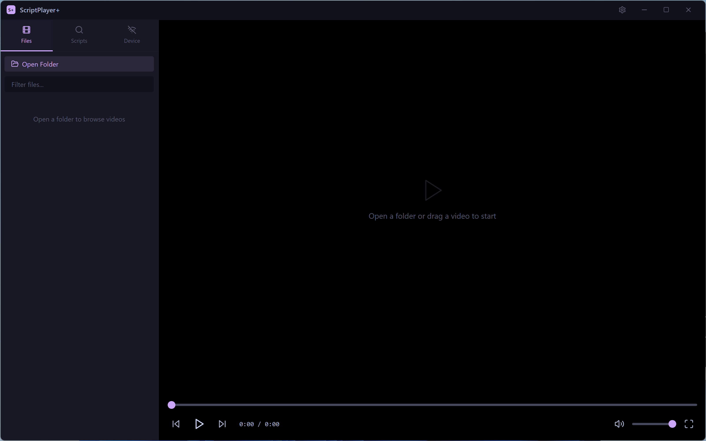
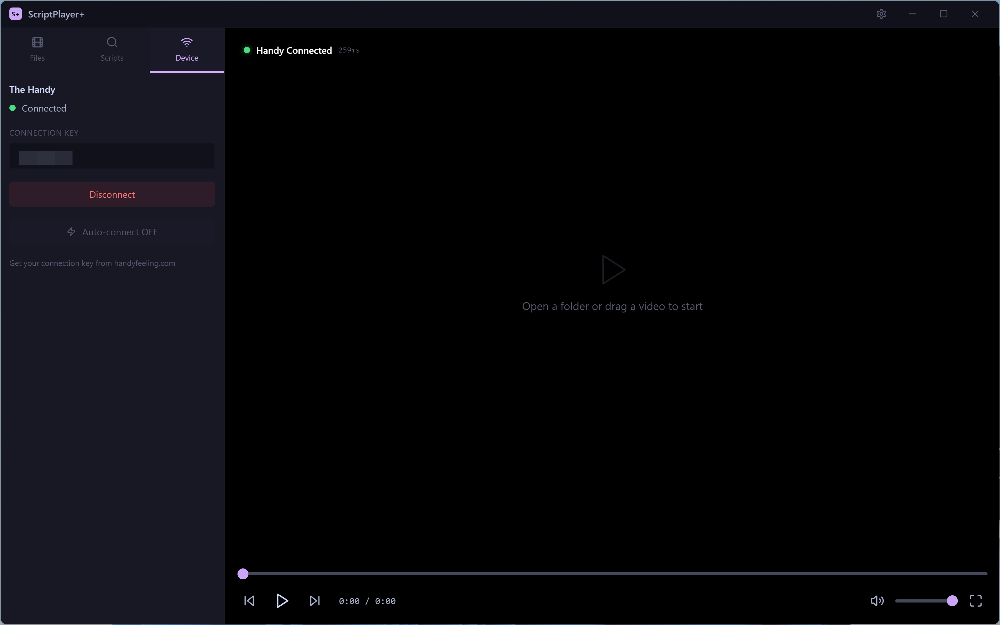

<p align="center">
  
</p>

<h1 align="center">ScriptPlayer+</h1>

<p align="center">
  <b>The Handy</b>連携、<b>EroScripts</b>ブラウザログイン、多言語対応のモダンなファンスクリプトビデオプレーヤー
</p>

<p align="center">
  <a href="../README.md">English</a> · <a href="README_KO.md">한국어</a> · <a href="README_JA.md">日本語</a> · <a href="README_ZH.md">中文</a>
</p>

---

## スクリーンショット

| メイン画面 | 再生（タイムライン＋ヒートマップ） |
|:-:|:-:|
|  |  |

| ヒートマップ＆タイムライン詳細 | Handyデバイス接続 |
|:-:|:-:|
|  |  |

| EroScripts検索 | 設定 |
|:-:|:-:|
|  |  |

## 主な機能

- **ビデオプレーヤー** — ローカル動画ファイルの再生（MP4、MKV、AVI、WebM、MOV、WMV）
- **ファンスクリプト対応** — 動画と同名の`.funscript`ファイルを自動読み込み
- **タイムライン表示** — スクリプトのアクションポイントを速度別の色でリアルタイム表示
- **ヒートマップ** — 動画全体の強度を色で可視化（緑→黄→オレンジ→赤→紫）
- **The Handy連携** — HSSPプロトコルでThe Handyデバイスと同期
  - 自動接続＆接続履歴
  - スクリプト自動アップロード
  - 時間オフセット調整
  - ストローク範囲のカスタマイズ
- **EroScripts連携** — アプリ内ブラウザログインでファンスクリプトの検索・ダウンロード（APIキー不要）
- **多言語対応** — English、한국어、日本語、中文
- **ドラッグ＆ドロップ** — 動画ファイルを直接プレーヤーにドロップ
- **フォルダブラウザ** — サブフォルダグループ化とスクリプト検出（緑チェックマーク）
- **キーボードショートカット** — Space、矢印キー、F（フルスクリーン）、M（ミュート）など
- **クロスプラットフォーム** — Windows（スタンドアロン）およびmacOS（GitHub Actions経由）

## インストール

### Windows

1. [Releases](https://github.com/sioaeko/scriptplayer-plus/releases)から最新バージョンをダウンロード
2. 解凍して`ScriptPlayerPlus.exe`を実行 — インストール不要

### ソースからビルド

```bash
git clone https://github.com/sioaeko/scriptplayer-plus.git
cd scriptplayer-plus
npm install
```

**開発モード：**
```bash
npm run electron:dev
```

**Windowsビルド：**
```bash
npm run build:win
```

**macOSビルド**（macOS必要）：
```bash
npm run build:mac
```

## キーボードショートカット

| キー | アクション |
|------|-----------|
| `Space` / `K` | 再生 / 一時停止 |
| `←` / `→` | ±5秒シーク |
| `Shift + ←/→` | ±10秒シーク |
| `↑` / `↓` | 音量 ±5% |
| `F` | フルスクリーン切替 |
| `M` | ミュート切替 |
| `Ctrl + ,` | 設定を開く |

## 技術スタック

- **Electron** — デスクトップアプリケーションフレームワーク
- **React** + **TypeScript** — UIコンポーネント
- **Tailwind CSS** — スタイリング
- **Vite** — ビルドツール
- **Handy API v2** — デバイス通信
- **Discourse API** — EroScripts連携

## ライセンス

MIT

---

<p align="center">
  Electron、React、Tailwind CSSで構築
</p>
