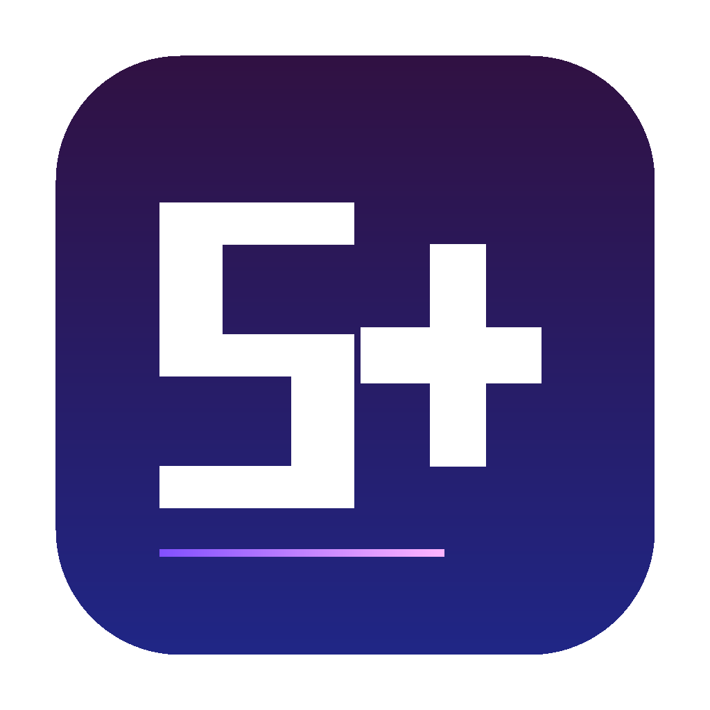
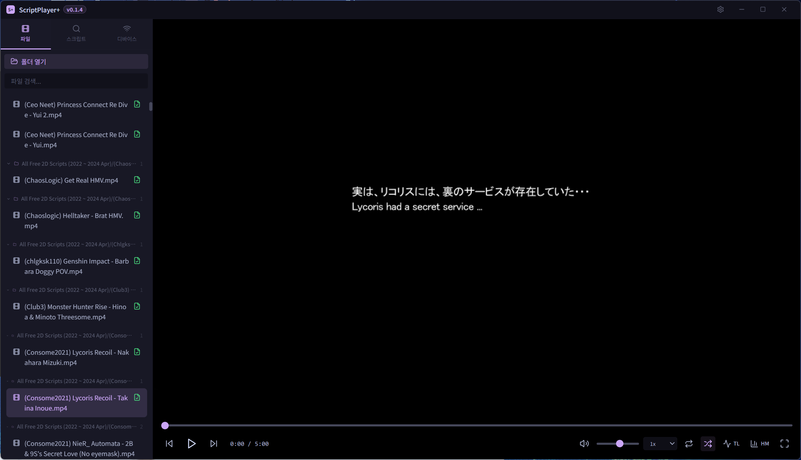
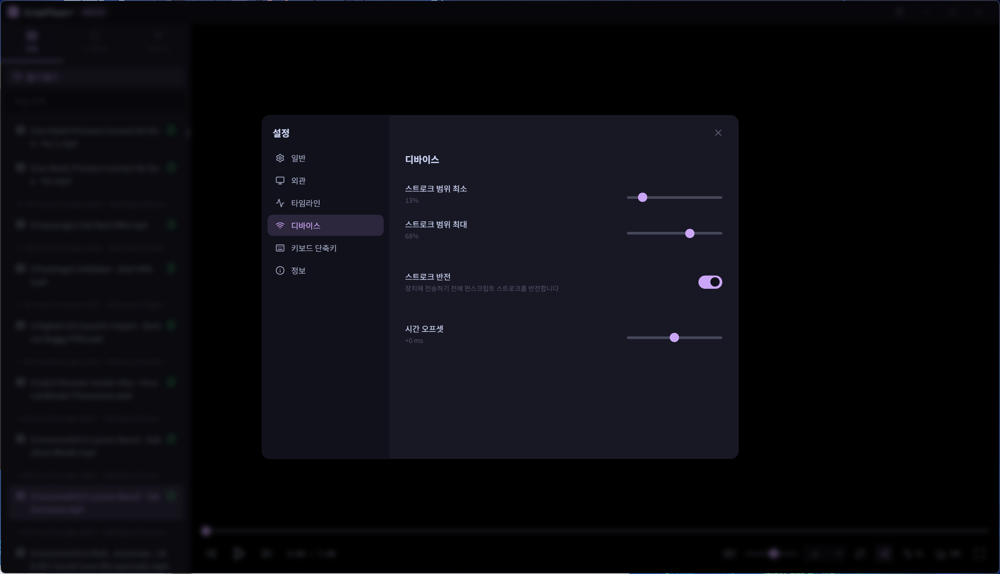
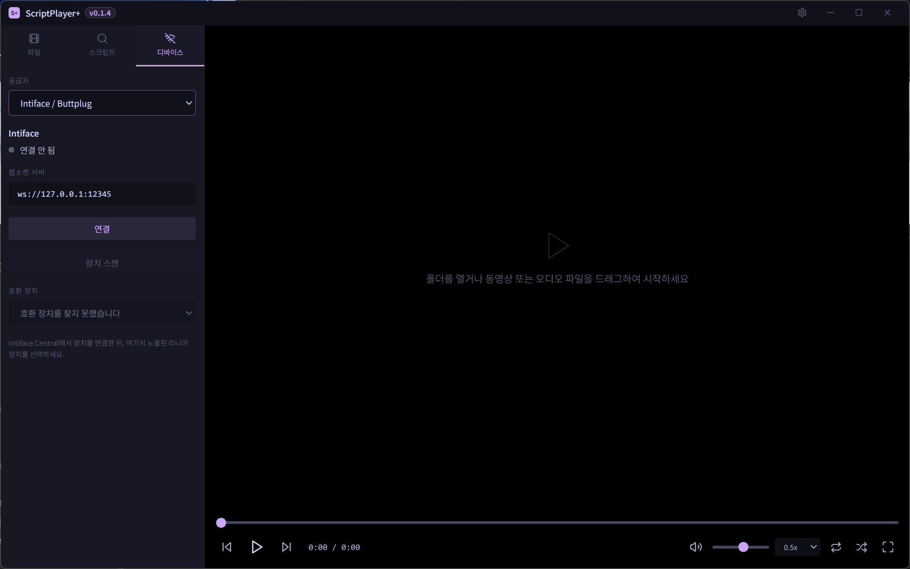

<p align="center">
  
</p>

<h1 align="center">ScriptPlayer+</h1>

<p align="center">
  <b>The Handy</b>連携、実験的な <b>Intiface / Buttplug</b> 対応、<b>EroScripts</b>ブラウザログイン、多言語対応のモダンなファンスクリプトビデオプレーヤー
</p>

<p align="center">
  <a href="../README.md">English</a> · <a href="README_KO.md">한국어</a> · <a href="README_JA.md">日本語</a> · <a href="README_ZH.md">中文</a>
</p>

---

## スクリーンショット

| v0.1.4 プレビュー | デバイス設定 |
|:-:|:-:|
|  |  |

| オーディオ再生 + ヒートマップ | オーディオ再生 |
|:-:|:-:|
|  |  |

| タイムライン設定 | Windows再生 |
|:-:|:-:|
|  |  |

| ヒートマップ＆タイムライン | EroScripts検索 |
|:-:|:-:|
|  |  |

| 設定 | macOS |
|:-:|:-:|
|  |  |

## 実験版 v0.1.5-exp.1

`v0.1.5-exp.1` のプレリリースでは、Intiface が認識した互換デバイス向けに実験的な `Intiface / Buttplug` マルチアクシス制御を追加しています。FUNSR 系の SR1 / SR6 / PRO も、Intiface で正しく検出されればこの経路でテストできます。

| v0.1.5-exp.1 プレビュー |
|:-:|
|  |

- プレリリースのダウンロード: [ScriptPlayer+ v0.1.5-exp.1](https://github.com/sioaeko/scriptplayer-plus/releases/tag/v0.1.5-exp.1)

## v0.1.4 の追加内容

- **連続再生 + シャッフル再生** — 再生終了後に現在のフォルダから次のファイルを自動再生するか、ランダムに次のファイルを選べます
- **再生速度コントロール** — プレーヤー上で `0.5x` から `2.0x` まで切り替えられ、Handy の同期も維持されます
- **Handy ストローク範囲の実動作対応** — ストローク最小/最大設定が UI 表示だけでなく、アップロードされるスクリプトに実際に適用されます
- **ストローク反転モード** — 取り付け方向や好みに合わせて funscript の位置を反転して送信できます

## 主な機能

- **ビデオ + オーディオプレーヤー** — ローカル動画ファイル（MP4、MKV、AVI、WebM、MOV、WMV）と音声ファイル（MP3、WAV、FLAC、M4A、AAC、OGG、OPUS、WMA）を再生
- **オーディオのアートワーク検出** — 同じフォルダ内のカバー画像を自動で見つけて表示します
- **再生モード** — 連続再生、シャッフル再生、再生速度変更をプレーヤーから直接使えます
- **ファンスクリプト対応** — メディアと同名の `.funscript` ファイルを自動読み込み
- **タイムライン表示** — スクリプトのアクションポイントを速度別の色でリアルタイム表示
- **ヒートマップ** — メディア全体の強度を色で可視化（緑→黄→オレンジ→赤→紫）
- **初期表示の切り替え** — 設定からタイムラインとヒートマップの初期表示を個別にオン / オフできます
- **The Handy連携** — HSSPプロトコルでThe Handyデバイスと同期
  - 自動接続＆接続履歴
  - スクリプト自動アップロード
  - 時間オフセット調整
  - ストローク範囲のカスタマイズ
  - ストローク反転トグル
- **EroScripts連携** — アプリ内ブラウザログインでファンスクリプトの検索・ダウンロード（APIキー不要）
  - ログインセッションをローカル保持
  - 設定したスクリプト保存フォルダへ直接ダウンロード
- **多言語対応** — English、한국어、日本語、中文
- **ドラッグ＆ドロップ** — 動画または音声ファイルを直接プレーヤーにドロップ
- **フォルダブラウザ** — サブフォルダグループ化とスクリプト検出（緑チェックマーク）
- **キーボードショートカット** — Space、矢印キー、F（フルスクリーン）、M（ミュート）など
- **クロスプラットフォーム** — Windows（スタンドアロン）およびmacOS（GitHub Actions経由）

## インストール

### Windows

1. [Releases](https://github.com/sioaeko/scriptplayer-plus/releases)から最新の `ScriptPlayerPlus-0.1.4-Windows-x64.zip` をダウンロード
2. 解凍して`ScriptPlayerPlus.exe`を実行 — インストール不要
3. Intiface 実験ビルドは [v0.1.5-exp.1 プレリリース](https://github.com/sioaeko/scriptplayer-plus/releases/tag/v0.1.5-exp.1) から `ScriptPlayerPlus-0.1.5-exp.1-Windows-x64.zip` をダウンロード

### macOS

1. [Releases](https://github.com/sioaeko/scriptplayer-plus/releases)から最新の macOS ビルドをダウンロード
2. 解凍して`ScriptPlayerPlus.app`をApplicationsフォルダに移動

### ソースからビルド

```bash
git clone https://github.com/sioaeko/scriptplayer-plus.git
cd scriptplayer-plus
npm install
```

**開発モード：**
```bash
npm run electron:dev
```

**Windowsビルド：**
```bash
npm run build:win
```

**macOSビルド**（macOS必要）：
```bash
npm run build:mac
```

## キーボードショートカット

| キー | アクション |
|------|-----------|
| `Space` / `K` | 再生 / 一時停止 |
| `←` / `→` | ±5秒シーク |
| `Shift + ←/→` | ±10秒シーク |
| `↑` / `↓` | 音量 ±5% |
| `F` | フルスクリーン切替 |
| `M` | ミュート切替 |
| `Ctrl + ,` | 設定を開く |

## 技術スタック

- **Electron** — デスクトップアプリケーションフレームワーク
- **React** + **TypeScript** — UIコンポーネント
- **Tailwind CSS** — スタイリング
- **Vite** — ビルドツール
- **Handy API v2** — デバイス通信
- **Discourse API** — EroScripts連携

## ライセンス

MIT

---

<p align="center">
  Electron、React、Tailwind CSSで構築
</p>
