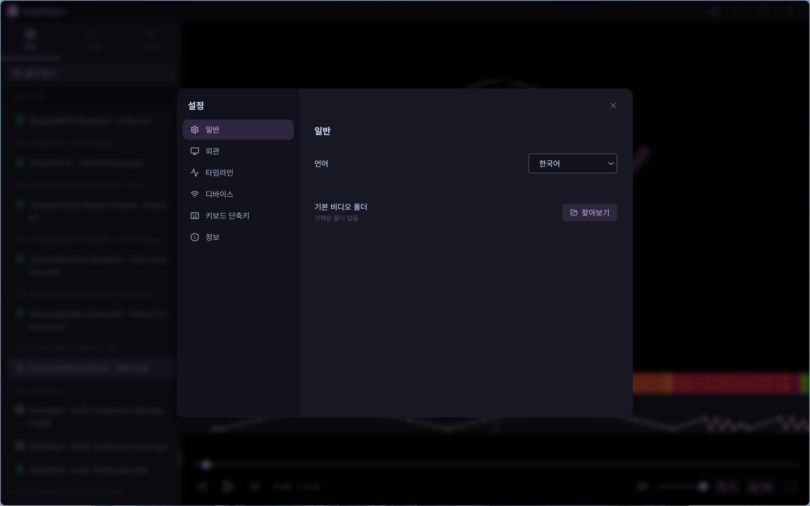

<p align="center">
  
</p>

<h1 align="center">ScriptPlayer+</h1>

<p align="center">
  <b>The Handy</b> 연동, <b>EroScripts</b> 브라우저 로그인, 다국어 지원을 갖춘 모던 펀스크립트 비디오 플레이어
</p>

<p align="center">
  <a href="../README.md">English</a> · <a href="README_KO.md">한국어</a> · <a href="README_JA.md">日本語</a> · <a href="README_ZH.md">中文</a>
</p>

---

## 스크린샷

| Windows | macOS |
|:-:|:-:|
|  |  |

| 히트맵 & 타임라인 | Handy 연결 |
|:-:|:-:|
|  |  |

| EroScripts 검색 | 설정 (한국어) |
|:-:|:-:|
|  |  |

## 주요 기능

- **비디오 플레이어** — 로컬 영상 파일 재생 (MP4, MKV, AVI, WebM, MOV, WMV)
- **펀스크립트 지원** — 영상과 같은 이름의 `.funscript` 파일 자동 로드
- **타임라인 시각화** — 스크립트 액션 포인트를 속도별 색상으로 실시간 표시
- **히트맵** — 전체 영상의 강도를 색상으로 한눈에 확인 (초록 → 노랑 → 주황 → 빨강 → 보라)
- **The Handy 연동** — HSSP 프로토콜로 The Handy 디바이스와 동기화
  - 자동 연결 & 연결 기록
  - 스크립트 자동 업로드
  - 시간 오프셋 조정
  - 스트로크 범위 커스터마이징
- **EroScripts 연동** — 앱 내 브라우저 로그인으로 펀스크립트 검색 및 다운로드 (API 키 불필요)
- **다국어 지원** — English, 한국어, 日本語, 中文
- **드래그 & 드롭** — 영상 파일을 플레이어에 바로 드롭
- **폴더 브라우저** — 하위 폴더 그룹핑 및 스크립트 유무 표시 (초록 체크마크)
- **키보드 단축키** — Space, 방향키, F (전체화면), M (음소거) 등
- **크로스 플랫폼** — Windows (스탠드얼론) 및 macOS (GitHub Actions)

## 설치

### Windows

1. [Releases](https://github.com/sioaeko/scriptplayer-plus/releases)에서 최신 버전 다운로드
2. 압축 해제 후 `ScriptPlayerPlus.exe` 실행 — 설치 불필요

### macOS

1. [Releases](https://github.com/sioaeko/scriptplayer-plus/releases)에서 `ScriptPlayerPlus-1.0.0-MacOS-Universal.zip` 다운로드
2. 압축 해제 후 `ScriptPlayerPlus.app`을 Applications 폴더로 이동

### 소스에서 빌드

```bash
git clone https://github.com/sioaeko/scriptplayer-plus.git
cd scriptplayer-plus
npm install
```

**개발 모드:**
```bash
npm run electron:dev
```

**Windows 빌드:**
```bash
npm run build:win
```

**macOS 빌드** (macOS 필요):
```bash
npm run build:mac
```

## 키보드 단축키

| 키 | 기능 |
|-----|------|
| `Space` / `K` | 재생 / 일시정지 |
| `←` / `→` | ±5초 이동 |
| `Shift + ←/→` | ±10초 이동 |
| `↑` / `↓` | 볼륨 ±5% |
| `F` | 전체화면 전환 |
| `M` | 음소거 전환 |
| `Ctrl + ,` | 설정 열기 |

## 기술 스택

- **Electron** — 데스크톱 애플리케이션 프레임워크
- **React** + **TypeScript** — UI 컴포넌트
- **Tailwind CSS** — 스타일링
- **Vite** — 빌드 도구
- **Handy API v2** — 디바이스 통신
- **Discourse API** — EroScripts 연동

## 라이선스

MIT

---

<p align="center">
  Electron, React, Tailwind CSS로 제작
</p>
